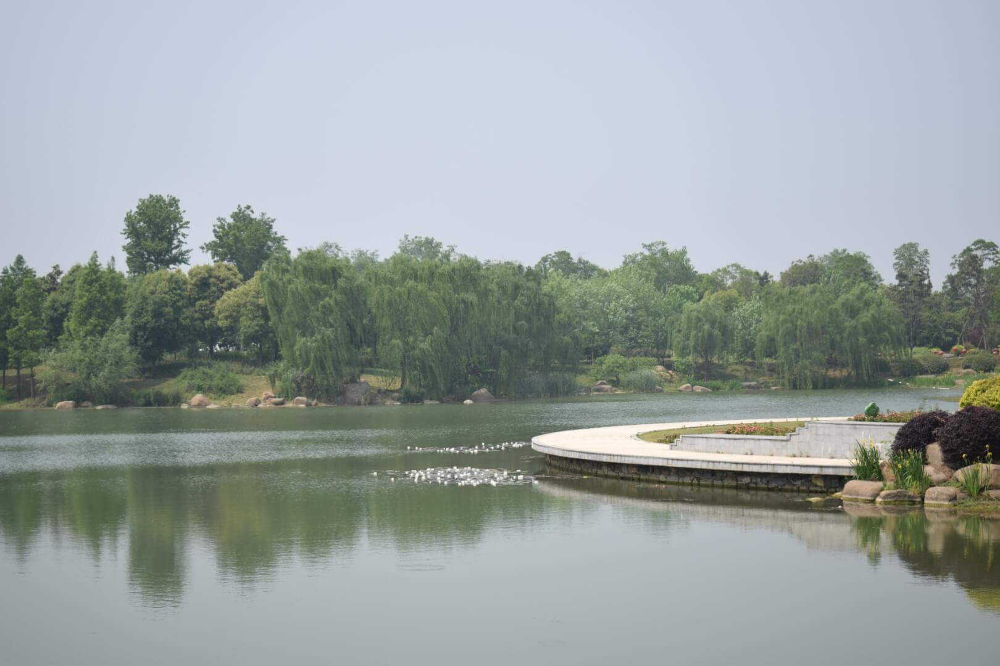

I just have been through a holiday break(5.1-5.5). Today is the first day of work. Suddenly I have no idea to do. What should I do?
I think I'm a little lost.

It seems there are a lot to learn in tech field. And I myself also have a lot that I haven't touched. But on the one hand, I don't have the initiative to get things down, on the other hand, where is the break point?

Do I really like the tech field? Do I really like coding? Sometimes I doubt it. There are a lot of things in our lives that could distract us from our original target. Motivations are easy to change. Sticking to one and to the end is remarkable. I think I do need to reorganize my thoughts on some sections.

I still remember my math teacher in college once said to us: If everyone could live from backwards, then everyone would be a great person. That's true! We never know what is the right choice for us at the current point. So we always make mistakes, always do some somthing that we might regret in the future. But life is one way forward, time goes by, never comes back. That's fair for everyone.

Well I know I grumbled a lot, without too much meanings there, just some emotions to express out. Anyways, May I find a way out soon.

